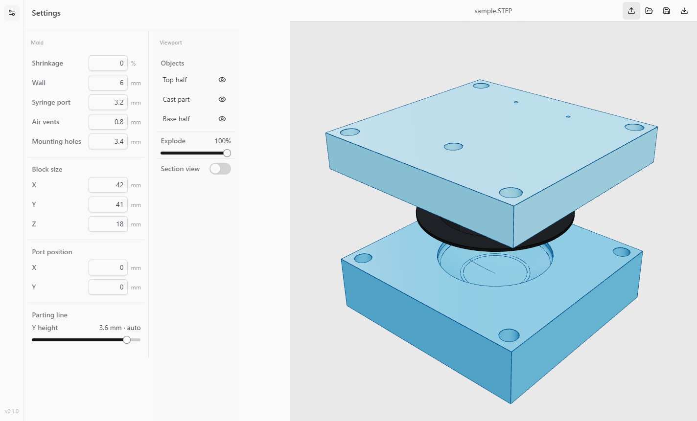

# MoldMaker

MoldMaker turns a finished part's STEP file into a printable two-part RTV silicone injection mold. It runs locally: upload the part, inspect the automatically generated tool, then export both mold halves as STEP and binary STL.

## Workflow

1. Select **Import STEP** and choose the finished part.
2. MoldMaker rotates the thinnest part axis onto the split direction, adds a shrinkage-compensated cavity, printable walls, four clamping screw holes, one syringe gate, and up to two air vents.
3. Inspect the exact OpenCascade result in the CAD viewport. Shading modes include solid, transparent, ghosted half, full edges, hidden cast part, and exploded view.
4. Select **Export mold**. The chosen directory receives `*-lower.step`, `*-upper.step`, `*-lower.stl`, and `*-upper.stl`.

The defaults target a general RTV workflow: 6 mm walls, a 3.2 mm syringe port, 0.8 mm vents, and 0.2% scale compensation. Confirm shrinkage against the silicone datasheet and inspect the split/gate placement before printing, especially for parts with deep undercuts.

## Preview

